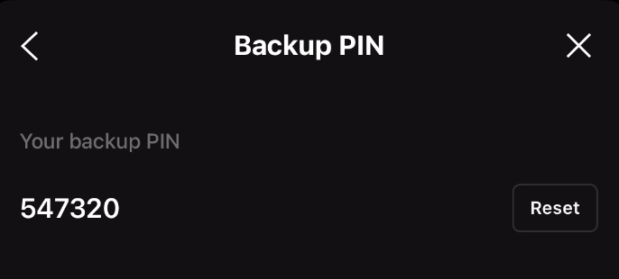

# line-sbc
This client is implemented based on reverse engineering of the LINE backup PIN.


### Usage
```
go get -u github.com/q0jt/line-sbc
```

### How To Get Backup Cert
```
E2EEKeyBackupService(/EKBS4)

cert = getE2EEKeyBackupCertificates()
GET https://obs.line-scdn.net/{cert}
```

### Getting started


```go
claim, err := sbc.CreateFromPin("mid", "backup PIN", "cert path")
if err != nil {
	log.Fatal(err)
}
restore, err := RestoreE2EEKeyBackup(
	&RestoreE2EEKeyBackupRequest{
		RestoreClaim: claim.Claim(),
	})
keys, err := claim.Restore(restore.RecoveryKey, restore.BlobPayload)
for _, backupKey := range keys {
	fmt.Printf("keyID: %d\n", backupKey.KeyID)
	fmt.Printf("private key: %s\n", backupKey.BackupKey.E2eePrivateKey)
}
```

### Note
```
E2EEKeyBackupException({Code:INVALID_PIN Reason:invalid pin ParameterMap:map[failedAttemptCount:2 maxAttemptCount:10]})
```
When the number of failed attempts reaches 10, the system is permanently locked and the data containing the E2EE key cannot be accessed.
