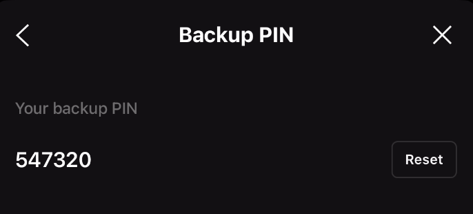

# line-sbc
LINE-SBC is an implementation based on the reverse engineering of the Secure Backup Client.     
It consists of client-side encryption (CSE) and the OPAQUE protocol base.   
go1.24.0 or later is required

[](https://pkg.go.dev/github.com/q0jt/line-sbc)

### Usage
```
go get -u github.com/q0jt/line-sbc
```

### How To Get Backup Cert
```
E2EEKeyBackupService(/EKBS4)

cert = getE2EEKeyBackupCertificates()
GET https://obs.line-scdn.net/{cert}
```

### Getting started


```go
claim, err := sbc.CreateFromPin("mid", "backup PIN", "cert path")
if err != nil {
	// error
}
restore, err := RestoreE2EEKeyBackup(
	&RestoreE2EEKeyBackupRequest{
		RestoreClaim: claim.Claim(),
	})
keys, err := claim.Restore(restore.RecoveryKey, restore.BlobPayload)
if err != nil {
	// error
}
fmt.Println("pin: ", keys.Passcode)
for _, key := range keys.LetterSealingKeys {
    fmt.Printf("key id: %d\n", key.KeyID)
    fmt.Printf("private key: %s\n", key.E2eeKey.PrivateKey)
}
```

> [!NOTE]
>
> ```
> E2EEKeyBackupException({Code:INVALID_PIN Reason:invalid pin ParameterMap:map[failedAttemptCount:2 maxAttemptCount:10]})
> ```
> There is an anti-brute force mechanism, and after 10 attempts at the backup PIN, the server will permanently lock the data containing the E2EE key, making it inaccessible.
